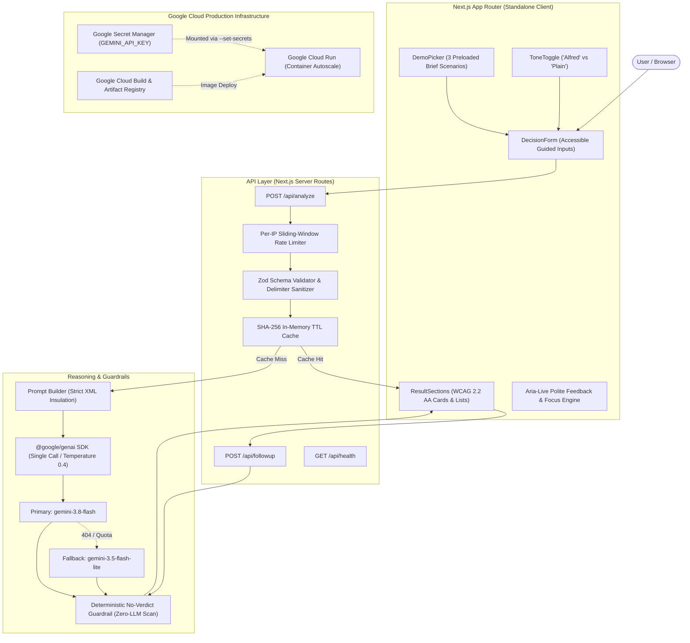

# Blind Spot 🧭
> **An AI-powered thinking companion that reveals unstated assumptions, overlooked dimensions, and internal conflicts in difficult decisions—without ever making the decision for you.**

[](https://github.com/GauravKatre-dev/the_blind_spot/actions/workflows/ci.yml)
[](https://opensource.org/licenses/MIT)
[](https://cloud.google.com/run)
[](https://ai.google.dev/)

Built for **PromptWars 2026** (Google for Developers: *Build with AI*).  
Challenge Track: **THE BLIND SPOT**.

---

## 1. Executive Summary & Philosophy

When humans face pivotal decisions—such as accepting a demanding startup internship, committing liquid savings to an EV, or relocating for a partner's career—we naturally suffer from cognitive blind spots: **present bias**, **unstated assumptions**, and **unacknowledged internal conflicts**.

**Blind Spot** is engineered with a strict ethical boundary:
> **"This tool does not decide for you; it helps you think."**

Unlike typical AI tools that rank options or prescribe a choice ("You should take Option A"), Blind Spot operates as a trusted **thinking companion**. It rigorously audits the user's reasoning, highlights what they omitted, questions what they took for granted, and generates structured inquiries that guide the user to make their *own* clear-eyed choice.

### Persona: "Alfred"
A discreet, calm, dry-witted companion in the spirit of a trusted family butler. Alfred provides restrained observations and pointed inquiries. If a user's dilemma touches on distress, family grief, or health crises, the wit is dropped entirely in favor of plain, gentle support. A **Plain** mode toggle is always available for direct, neutral analytical wording.

---

## 2. Architecture & System Flow



---

## 3. Google Services Usage

| Google Service | Role & Concrete Implementation |
|---|---|
| **Google Gemini API** (`@google/genai`) | Powers the single-call structured reasoning engine. Operates on `gemini-3.8-flash` with dynamic fallback to `gemini-3.5-flash-lite`. Configured with `temperature: 0.4` and structured OpenAPI `responseSchema`. |
| **Google Cloud Run** | Fully managed serverless container runtime hosting the production Next.js standalone application with automatic scaling, HTTPS, and non-root execution. |
| **Google Secret Manager** | Securely mounts `GEMINI_API_KEY` into Cloud Run via `--set-secrets`. The key is never committed, never present in Docker images, and never accessible in client bundles. |
| **Google Cloud Build / Artifact Registry** | Container image compilation and continuous deployment pipeline using multi-stage builds. |
| **Firebase / Firestore** (Phase P4) | Anonymous user analysis persistence with local in-memory fallback. |

---

## 4. Rigorous Guardrails: The Zero-Verdict Guarantee

To ensure compliance with the challenge mandate ("NEVER make the decision for the user"), Blind Spot implements a **two-layer deterministic defense**:

1. **System Prompt Hard Rules**:
   - Explicitly instructs the model to omit any recommendation or comparative ranking.
   - User input is encapsulated inside `<user_input>` XML tags with delimiter escaping to prevent prompt-injection breakouts.
2. **Deterministic Post-Generation Guardrail** (`src/lib/guardrail.ts`):
   - Recursively traverses every string in the structured output.
   - Evaluates against a tested pattern dictionary (`\byou should\b`, `\bI recommend\b`, `\bthe best choice\b`, `\bgo with\b`, `\byou must\b`, `\bmy advice\b`, etc.).
   - If a violation is caught, it retries once with an explicit negative constraint; if it persists, it automatically sanitizes the response to maintain user autonomy.

---

## 5. Accessibility & Inclusivity (WCAG 2.2 AA)

- **Semantic Landmarks**: Native `<header>`, `<main id="main-content">`, and `<footer>` elements.
- **Skip Link**: Top-level accessible skip link for keyboard-only navigation.
- **Heading Hierarchy**: Strict `h1` &rarr; `h2` &rarr; `h3` heading structure.
- **Screen Reader Announcements**: `aria-live="polite"` on results container, moving focus to `#analysis-results-heading` upon analysis completion.
- **Accessible Form Controls**: Every input features a programmatic `<label>` and descriptive hint text linked via `aria-describedby`.
- **Redundant Visual Encoding**: Severity levels are conveyed using both text labels (*"High Impact"*, *"Moderate Impact"*, *"Minor Factor"*) and distinct SVG icons (`AlertTriangle`, `AlertCircle`, `Info`)—never color alone.
- **Touch Targets**: All interactive elements maintain touch targets of at least 44&times;44px.
- **Motion Safety**: Respects the `prefers-reduced-motion` media query.

---

## 6. Preloaded Demo Scenarios

Evaluators can click any of the 3 preloaded scenarios on the home screen:

1. **6-Month Tech Startup Internship** *(from hackathon brief)*:
   - *Dilemma*: Deferring graduation for a $4,500/month 50+ hr/wk startup internship vs. finishing final semester capstone classes on schedule.
   - *Blind spots revealed*: Capstone prerequisite delay, cohort disconnect, real mentorship availability vs. feature-shipping pressure.
2. **Financing EV vs. Investing Liquid Savings**:
   - *Dilemma*: Spending $38,000 liquid capital on an EV for fuel savings vs. investing in index funds.
   - *Blind spots revealed*: Opportunity cost of capital, emergency liquidity buffer depletion, depreciation curve vs. fuel savings break-even.
3. **Relocating for Partner's Career Milestone**:
   - *Dilemma*: Moving cross-country to Seattle for partner's promotion vs. staying near aging parents.
   - *Blind spots revealed*: Caregiver infrastructure burden, emotional isolation, career optionality for both partners.

---

## 7. Local Development & Testing

### Prerequisites
- Node.js `v22.x`
- npm `v10.x`

### Setup
```bash
# Clone the repository
git clone https://github.com/GauravKatre-dev/the_blind_spot.git
cd the_blind_spot

# Install dependencies
npm ci

# Configure environment (create .env.local; never committed)
cp .env.example .env.local
# Add your GEMINI_API_KEY to .env.local
```

### Verification Scripts
```bash
# Run all 36 unit tests with Vitest
npm test

# Run coverage report (>82% target on src/lib)
npm run test:coverage

# TypeScript strict typecheck
npm run typecheck

# ESLint audit
npm run lint

# Production standalone build
npm run build
```

---

## 8. Evaluator Scorecard Reference

See [SCORECARD.md](SCORECARD.md) for concrete file-by-file mappings across all 7 evaluation criteria:
1. Code Quality
2. Security
3. Efficiency
4. Testing
5. Accessibility
6. Problem Statement Alignment
7. Google Services Usage
